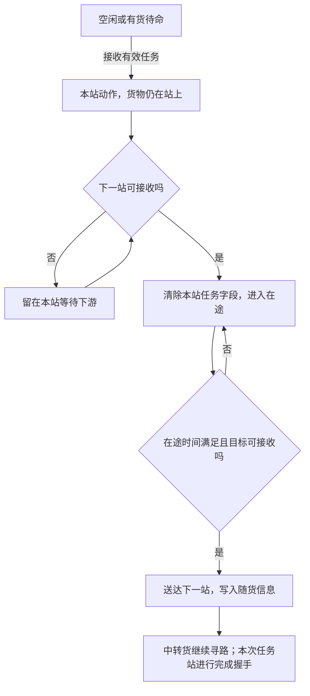

# PLC 模拟器

用于在本机模拟输送机与堆垛机的通信和动作流程。支持配置加载、设备状态监视、人工操作、报文日志和自动化测试。

## 环境与构建

需要 .NET 10 SDK；图形调试台需要 Windows。
以下命令从包含 `PlcSimulator` 的工作区根目录执行：

```powershell
dotnet build PlcSimulator/PlcSimulator.slnx -c Release -m:1
dotnet test PlcSimulator/PlcSimulator.slnx
```

图形程序位于 `PlcSimulator/PlcSimulator.App/bin/Release/net10.0-windows/PlcSimulator.App.exe`。

## 启动与配置加载

1. 打开图形程序，点击“打开配置…”，选择 JSON 配置。
2. 双击主窗口中的配置行，打开对应的模拟器窗口。
3. 点击窗口中的“启动”，或使用主窗口的“全部启动”。
4. 停止服务使用“停止”或“全部停止”。关闭子窗口不会停止该配置的服务；关闭主窗口会停止全部服务。

可以同时加载多份配置，每份配置独立运行。建议输送机与堆垛机使用不同的配置文件，便于分别查看设备与报文。

命令行也可以校验和运行配置：

```powershell
dotnet run --project PlcSimulator/PlcSimulator.Cli -- check PlcSimulator/config/simulator.json
dotnet run --project PlcSimulator/PlcSimulator.Cli -- serve --config PlcSimulator/config/simulator.json --log-frames
```

`check` 只校验配置，不启动通信。`serve` 启动通信与状态机。
`--log-frames` 显示收发报文，`--log-file <路径>` 保存日志。
同一监听端点不能同时被图形程序与命令行程序占用。

## 配置生成

主窗口点击“配置生成…”，先选择设备类型，再选择 CSV 或 `.xlsx` 输入文件与 JSON 输出路径。
读取 Excel 时使用第一个工作表；旧版 `.xls` 需先转换为 `.xlsx` 或 CSV。
配置通过校验后才写入输出文件，生成完成后可以立即加载。

### 输送机

选择“输送机”，设置监听 IP、端口、字段协议、动作延时和输入地址单位。
支持 NTI、CATL 字段协议，通信使用 Modbus TCP，默认端口 502。

| 输入列 | 用途 |
|---|---|
| `stationno` | 站台编号，必需 |
| `userid` | 设备 IP，必需；可在生成页覆盖 |
| `value` | 站台地址，必需 |
| `signaltype` | 站台数据长度，必需 |
| `itemname` | 显示名称 |
| `objects`、`belong`、`field1` | 设备分组信息 |
| `locationx/locationy/width/height` | 站台布局 |
| `arrowdirection`、`zonecode`、`remark`、`field5` | 方向、分区与拓扑辅助信息 |

地址单位默认“寄存器”：字节地址和长度均为输入值乘以 2。选择“字节”时直接使用输入值。
`belong=0` 的行和站台编号为空的行会跳过，并在生成日志中说明。

```powershell
dotnet run --project PlcSimulator/PlcSimulator.Import -- conveyor.csv -o PlcSimulator/config/conveyor.generated.json
```

### 堆垛机

选择“堆垛机”，通讯方式可选 Socket 或 S7。设备按编号合并，保留货叉数量、站台动作点和取放站台信息。

| 输入列 | 用途 |
|---|---|
| `equipmentnum` | 设备编号，必需 |
| `RIPADDR` | 设备 IP，必需；可覆盖或分配独立回环 IP |
| `protocoltype` | 原通信类型，必需；支持 NTI Socket/S7 与 SRM |
| `stationpoint` | 动作点映射，必需；格式 `P1,2;P2,3;` |
| `rport` | Socket 通信端口 |
| `forktype` | 货叉配置；`3;3` 为双货叉，`1;1`、`2;2` 为单货叉 |
| `pickstation/putstation` | 取货、放货站台，逗号分隔 |
| `field3/field2` | 显示名称、设备分组 |
| `wdbaddr/rdbaddr` | 原 S7 输入的指令、状态 DB 编号 |
| `wdblength/rdblength` | 原 S7 输入的指令、状态字节数 |
| `field4/field5` | 近远端与避让配置原值 |

Socket 输入的同一设备需包含 2000、4000、6000 三个端口的行，生成后合并成一台设备。
同一设备的名称、IP、货叉或动作点等公共字段不一致时，生成会报错。
不支持的协议行会跳过；没有可生成设备时会报错。

选择 S7 时可设置端口、DB 编号、指令布局及状态和报警长度。
原 S7 输入沿用其指令/状态 DB 和状态长度；报警 DB 使用生成页设置值。
指令布局以页面选择为准，不能用导出的 `wdblength`（写入区长度）推断实际报文的前导字节。
本工作区 WCS 的 `SendCodeNTI` 经 S7 写入的是 23 字节裸负载，应选择“23 字节（负载偏移 0）”；
读取 DB 的状态布局、长度与写入 DB 独立，状态字段仍按原布局解析。
从 Socket 输入生成 S7 时使用生成页填写的 DB 映射。

勾选“每台使用独立回环 IP”后，可填写“起始回环 IP”（默认 `127.0.0.1`）。
例如从 `127.0.0.20` 开始，两台设备依次分配 `127.0.0.20`、`127.0.0.21`。
按导出文件中设备首次出现的顺序分配，跨末段边界会自动进位：`127.0.0.255` 的下一个地址为 `127.0.1.0`。
只允许完整的 `127.x.x.x` IPv4 地址，分配结果超出回环范围时会报错。
关闭此选项后使用输入 IP 或填写的 IP 覆盖值。通信客户端需连接生成配置中的地址。

```powershell
dotnet run --project PlcSimulator/PlcSimulator.Import -- stacker.csv --device-kind srm --transport Socket --loopback-ips -o PlcSimulator/config/stacker.socket.json
dotnet run --project PlcSimulator/PlcSimulator.Import -- stacker.csv --device-kind srm --transport S7 --loopback-ips --loopback-start-ip 127.0.0.20 --command-db 60 --status-db 61 --alarm-db 70 -o PlcSimulator/config/stacker.s7.json
```

公共选项：`--ip`、`--port`、`--delay`、`--jitter`。
输送机选项：`--protocol-type`、`--value-is-byte`、`--value-is-register`。
堆垛机选项：`--travel-delay`、`--status-length`、`--alarm-length`、`--command-payload-offset 0|2`。
完整选项使用 `dotnet run --project PlcSimulator/PlcSimulator.Import -- --help` 查看。

## 输送机模拟

输送机窗口提供点位监视、流程状态机、路径诊断、报文日志和故障注入。
点位监视与流程状态机支持搜索设备，便于快速定位。

### 执行层与状态

| 层 | 职责 |
|---|---|
| 协议服务 | 收发报文、读写数据区，不直接推进搬运 |
| `DeviceRegisterSpace` | 保存通信字节，使用锁保护数据区读写 |
| `SimulationEngine` | 默认以 50 ms tick 在单一执行循环中推进状态机，执行排队的界面操作 |
| `ConveyorStationMachine` | 接单、动作、检查下游、搬运、完成握手及清空 |

通信写入先落到数据区，状态机在后续 tick 读取。界面的手动、清空和复位操作经引擎队列执行，避免与搬运推进并发修改状态。

| 状态 | 含义 | 能否接收上游托盘 |
|---|---|---|
| `Idle` | 空闲 | 自动模式下可以 |
| `Loaded` | 本站有货待命 | 不可以，已有货物不能被覆盖 |
| `Executing` | 本站动作中 | 不可以 |
| `WaitingDownstream` | 发车前等待下游 | 不可以 |
| `Transferring` | 已离站、正在前往下一站 | 不可以，本站仍有正在执行的搬运 |
| `Done` | 本次任务完成，等待清零握手 | 不可以 |
| `Fault` | 故障 | 当前接收判定未将它列为占用，自动模式下仍可接收 |

“正在作业”和“被占用”不是同一概念。`Loaded` 可以受理客户端给本站的新任务，但不能接收上游另一托盘。
当前故障态不作为收货的强制阻断条件；路径诊断会提示这一实现行为，不应假设故障站台一定拦住上游托盘。

### 一次搬运的过程



1. **接单**：`Idle/Loaded` 在自动模式下读取非零 `tasknum`。每个任务只采样一次动作抖动，不会每个 tick 改变延时。
   任务号可复用；随货带到终点的任务号会被识别为已有货物信息，避免反复触发搬运。
2. **动作**：进入 `Executing`，货物仍在本站。有效动作时间达到 `actionDelayMs + 抖动` 后解析下一站。
3. **检查目标**：目标就是本站时不搬运，货物留站并进行完成握手。
   目标不在配置范围时，保留任务与货物信息，回到有货待命，不置完成心跳。
   客户端修正目标后可重新执行，不必更换任务号。
4. **检查下游**：下一站收不下时进入 `WaitingDownstream`，托盘和任务字段留在本站，每个 tick 重试。
5. **离站**：真正发车时清除本站的任务号、货物类型、来源、目标、条码，进入 `Transferring`。
   搬运信息保留在状态机缓存中；此时本站与下一站均可显示无货。
6. **送达**：达到 `transferDelayMs` 后再次检查目标是否可接收，再将完整随货信息写入目标站台。
   途中目标变忙时保持在途等待，不丢弃货物，也不覆盖目标已有信息。
7. **收尾**：中转站转发后直接回空闲，不置完成心跳。客户端直接下发任务的站台送达下一站后进入 `Done`，等待清零握手。
   清零完成后，货已离站则回 `Idle`；货仍留在本站则回 `Loaded`。
   `clearTimeoutMs` 触发等待超时事件，但不会自动清除任务或改变状态。

完成握手使用 `simulation.heartbeat` 设置的值；NTI 使用 `heartbeat` 字段，CATL 使用 `ack`。
**起点完成握手表示本次投送到下一站完成，不等于货物已到最终目标。** 中间站台仍可能继续动作或等待下游。

### 逐站寻路与提升机

下一站由 `ResolveDestination` 决定：存在可达拓扑时，使用 BFS 查找最短路径，取路径上的下一站；中间站台继续使用同一个最终目标寻路。
没有拓扑或找不到路径时，当前实现回退为按最终目标直接投送。因此，启动服务前应先校验路线，不能把“最终收到货物”当成中间路线正确的证据。

建图规则：

- 以 `stationno` 作为节点标识，`itemname` 仅用于显示。
- 同 `zonecode` 内，沿配置方向且按坐标、宽高判断为相邻的站台建立有向连接。
- 方向值为 `1=上、2=下、3=左、4=右`；允许配置多个方向，例如 `1,3`。
- `arrowdirection=0` 或 `field5=1` 的站台不参与输送拓扑。
- `remark=提升机` 的站台按站台号前四位归组，整组折叠为一个拓扑节点。
- 建图使用全部站台，包括别名站台；共享数据区的站台在运行时使用同一个物理状态机。

提升机作为中转站时，发车前多检查一站：提升机下一站收不下，托盘留在提升机前的站台等待。
若提升机自身就是最终目标，则允许货物留在该站。

| 等待类型 | 发生时机 | 货物位置 | 任务信息 | 恢复条件 |
|---|---|---|---|---|
| `WaitingDownstream` | 发车前发现下游不可接收 | 本站 | 数据区原样保留 | 下游可接收 |
| 在途等待 | 已离站，途中目标变忙 | 在途缓存，两站显示无货 | 搬运缓存保留 | 目标可接收 |

### 随货信息与时间

任务号、货物类型、条码和最终目标随货逐站传递。来源站台每跳更新为刚交付货物的站台，终点看到的来源是上一跳，不一定是任务起点。
中转货物使用缓存中的搬运信息继续执行，不把读取布局中的数据当成新的写入指令解析。
不同协议的读写字段偏移可能不同，例如 CATL 的目标字段读偏移为 36、写偏移为 4；使用缓存可避免串用布局。
条码按相同的输出编码读出、再写入下一站，不会每转发一站就翻转一次。

| 参数 | 含义 |
|---|---|
| `simulation.actionDelayMs` | 本站动作时间 |
| `simulation.transferDelayMs` | 离站到下一站的在途时间 |
| `simulation.jitterMs` | 每次动作采样的正负抖动范围 |
| `simulation.clearTimeoutMs` | 等待完成握手清零的告警时间，0 表示不启用 |

生成输送机配置时，界面的“动作延时 (ms)”写入各站台的 `simulation.actionDelayMs`，
“抖动 (ms)”写入 `simulation.jitterMs`。单位均为毫秒，1000 ms 等于 1 秒。
动作延时表示托盘在本站执行动作的模拟耗时；动作结束且满足转移条件后，才进入去往下一站的在途阶段。
每次本站动作开始时，从 `[-jitterMs, +jitterMs]` 中随机取一个整数，与动作延时相加，结果最低为 0。
抖动是随机增减范围，不是固定追加的等待时间，也不作用于站间在途时间。

例如动作延时为 3000 ms、抖动为 200 ms，本站动作耗时为 2800～3200 ms。
之后站间在途时间另算，由 `simulation.transferDelayMs` 设置，当前默认 1000 ms；
生成配置界面的“行走延时”仅用于堆垛机，不设置输送机的在途时间。
若希望动作时间固定以便调试，将抖动设为 0。

例如配置一条模拟路线 `9001 → 9002 → 9003 → 9004`，每站动作 3000 ms、在途 1000 ms、抖动为 0：

| 阶段 | 理想累计计时预算 |
|---|---|
| 9001 送达 9002 | 约 4 秒；9001 可进入完成握手 |
| 9002 送达 9003 | 约 8 秒 |
| 9003 送达 9004 | 约 12 秒；9004 留货等待下一任务 |

这是无堵塞、全自动下的参数预算。实际推进受 tick 调度、手动冻结、下游等待等影响，不保证精确到达时刻。
引擎通过 `Tick(delta)` 推进计时，测试可使用 `AdvanceOneTick()`；固定输入、相同 tick 序列与相同随机种子便于重放。
正常启动不会自动固定每个状态机的随机种子。

### 状态显示、手动、清空与复位

NTI 状态位中，X8 为装载状态（0 有货、1 无货），X9 为自动模式，X10 为故障。
`Loaded/Executing/WaitingDownstream` 显示有货；`Transferring/Done` 显示无货，不能只凭载货位判断本站是否仍被任务占用。
CATL 使用对应的单字节状态字段，字段编码由其协议模板决定。

手动模式冻结当前机械动作，也阻止接收上游货物。恢复自动后继续剩余动作时间，暂停时长不计入有效动作时间。
手动不冻结 `Done` 的清零握手，通信仍可正常处理。

人工“有货/清空”与手动模式是两类操作：注入有货只适用于可注入的空闲状态；作业中不能再注入新货。
**清空支持动作中、等下站和移动中**，会取消本站当前搬运并清除任务、握手与在途缓存；已经送达其他站台的托盘不受影响。
通信客户端显式写零任务号也会同步清空本站任务并复位状态机；站台正常离站时自行清零不触发这一外部清空操作。
“复位”按配置初值重建站台状态，和只清除当前货物不同。

### 路线校验与路径诊断

路径诊断与运行使用同一套 `StationTopology` 建图规则，并使用共同的占用、手动和可接收判定。
诊断只读，不下发任务、不修改数据区；可以在启动前反复校验，也可以在运行中查看状态快照。

**图形入口**：在输送机窗口打开“路径诊断”，填写起点与目标站台号，按回车或点击“诊断”。
图形报告包含当前沿途状态，用于查看托盘可能在哪一站等待；快照之后设备状态仍可能变化。
服务未启动时，界面取配置初始状态进行推演，不表示设备已经实际运行。

**命令行入口**：普通 `path` 显示结论，`--detail` 展开过程。命令行读取配置进行离线诊断，不包含运行中的实时状态。

```powershell
dotnet run --project PlcSimulator/PlcSimulator.Cli -- path PlcSimulator/config/conveyor.generated.json 9001 9004
dotnet run --project PlcSimulator/PlcSimulator.Cli -- path PlcSimulator/config/conveyor.generated.json 9001 9004 --detail
```

站台号需替换为实际配置中的编号。详细报告包含以下内容：

| 内容 | 用途 |
|---|---|
| 结论与路线 | 起终点是否存在、是否参与拓扑、是否同属一个节点、是否可达 |
| 时间预算 | 各跳动作与在途时间累计，按 tick 向上取整，并给出抖动区间 |
| 候选邻居 | 每跳选择了哪个邻居，其他候选为什么未选中 |
| 实时推演 | 图形界面中标出忙、占用或手动导致的潜在等待点 |
| 方向对照 | 放开方向约束后寻找参考路径，并列出缺少或可能配置错误的方向 |

方向对照不会自动修改配置。它仍使用相同的建图算法，只将参与建图站台的方向放开为四向可达。
参考路线优先选择需要补方向的断点最少的路线，使用 0-1 BFS：原规则可走的边代价为 0，需要补方向的边为 1。
该路线不一定是跳数最少的路线。

例如 `9002 → 9003` 的几何关系是向左，而 9002 只配置方向 `2`，报告可能指出应补方向 `3`。
同时会对照“配置了却没有邻居的方向”与“存在邻居却没有配置的方向”，帮助排查写反。
应核对并修改模拟器配置或用于生成配置的输入文件，再重新加载并校验。
放开方向后仍走不通时，应检查分区、坐标、宽高、拓扑排除项和提升机归组。

| 现象 | 优先查看 |
|---|---|
| 直接到终点，没经过中间站 | 是否无拓扑或拓扑不可达，导致运行回退为直接投送 |
| 某一跳断开 | 方向对照中的第一处断裂与所需方向 |
| 走出意外近路 | 候选邻居、提升机归组是否错误地合并设备 |
| 到某站后不再移动 | 实时状态中的下游占用、手动及提升机下一站 |
| 站台号查不到 | 站台是否存在，是否因方向 0 或 `field5=1` 被排除 |
| 耗时偏长 | 各站延时、抖动、等待时间和完成握手状态 |

路线校验只证明当前模拟器配置的拓扑和状态推演，不证明外部任务已创建，也不保证真实设备完成搬运。
流程实现参见 [ConveyorStationMachine.cs](PlcSimulator.Devices/Stations/ConveyorStationMachine.cs)、
[SimulationEngine.cs](PlcSimulator.Devices/SimulationEngine.cs)、[StationTopology.cs](PlcSimulator.Devices/Topology/StationTopology.cs)
及 [PathDiagnostics.cs](PlcSimulator.Devices/Topology/PathDiagnostics.cs)。
相关测试包括 `CargoTransferTests`、`HopByHopTransferTests`、`ManualModeTests`、`PathDiagnosticsTests`。

## 堆垛机模拟

堆垛机窗口显示设备状态、工作模式、当前位置、货叉状态、任务号和报文。
支持取货、放货、移动、盘点、双货叉及火警避让模拟，并提供手动、火警与复位操作。
行走时间和动作时间分别由 `srm.travelDelayMs`、`srm.actionDelayMs` 设置。

### 生成配置时的延时参数

单位均为毫秒，1000 ms 等于 1 秒。生成器将这些参数写入每台堆垛机的 `srm` 配置。

| 界面参数 | 配置项 | 含义 |
|---|---|---|
| 行走延时 (ms) | `srm.travelDelayMs` | 行走、定位的模拟耗时 |
| 动作延时 (ms) | `srm.actionDelayMs` | 取货、放货、盘点的模拟动作耗时；这些任务还需加上行走延时 |
| 抖动 (ms) | `srm.jitterMs` | 每次动作随机增减的时间范围，作用于移动及取货、放货、盘点任务 |

每次接受动作指令时，从 `[-jitterMs, +jitterMs]` 中随机取一个整数，作为本次动作的抖动值。
纯移动任务耗时为“行走延时 + 抖动值”；取货、放货、盘点任务耗时为“行走延时 + 动作延时 + 抖动值”，
计算结果最低为 0。抖动不是固定追加的等待时间。

例如生成界面设置动作延时 3000 ms、抖动 200 ms、行走延时 1000 ms：

| 流程 | 时间计算 | 执行时间范围 |
|---|---|---|
| 移动中 → 移动完成 | `1000 ± 200` ms | 0.8～1.2 秒 |
| 取货中 → 取货完成 | `1000 + 3000 ± 200` ms | 3.8～4.2 秒 |
| 放货中 → 放货完成 | `1000 + 3000 ± 200` ms | 3.8～4.2 秒 |
| 盘点中 → 盘点完成 | `1000 + 3000 ± 200` ms | 3.8～4.2 秒 |

若希望移动固定耗时 5 秒，取货、放货、盘点各固定耗时 8 秒，可设置：

```json
"travelDelayMs": 5000,
"actionDelayMs": 3000,
"jitterMs": 0
```

当前取货、放货、盘点共用动作延时，不能为每个状态单独设置时间。
完成状态不会计时自动复位，而是等待后续指令。
上述时间是模拟执行时间，实际观察还受 tick 调度和 WCS 轮询周期影响。
各堆垛机可在 JSON 中分别设置参数；修改已加载的配置后，需停止并关闭该配置，再重新打开并启动。

Socket 与 S7 共用业务字段和状态机；任务号按两个货叉分别使用两字节编码。
取货报告为 `113 → 121`，放货报告为 `129 → 137`，功能码 0 清除任务并回到空闲。
动作点使用 `srm.stationPoints`；避让点使用 `srm.avoidancePoint`。
生成日志提示避让点未映射时，应先补全该配置再执行火警模拟。

### Socket

示例配置：`config/simulator.srm.json`。

| 端口 | 功能 |
|---|---|
| 2000 | 接收 26 字节指令帧，不返回应答 |
| 4000 | 每收到一个 `0xFF` 返回一帧状态 |
| 6000 | 每收到一个 `0xFF` 返回一帧报警位图 |

状态帧默认 74 字节，报警帧默认 100 字节，可通过 `socketPorts` 配置。
Socket 指令块前两字节为前导，业务负载从偏移 2 开始。

```powershell
dotnet run --project PlcSimulator/PlcSimulator.Cli -- srm cycle --config PlcSimulator/config/simulator.srm.json
```

`srm cycle` 使用 Socket 进行取货、放货和清除闭环验证。

### S7

示例配置：`config/simulator.srm.s7.json`。通信使用 ISO-on-TCP / S7comm，默认端口 102。

| 数据区 | 默认地址 | 默认长度 | 访问 |
|---|---|---|---|
| 指令 | `DB60.0` | 26 字节 | 读写 |
| 状态 | `DB61.0` | 74 字节 | 只读 |
| 报警 | `DB70.0` | 100 字节 | 只读 |

通过 `s7.command/status/alarm` 的 `dbNumber`、`byteOffset` 设置映射地址。
允许在同一 DB 中使用不重叠区段。业务数据不做字节交换。
`commandPayloadOffset=2` 使用 26 字节指令块；设置为 0 使用 23 字节业务负载。
状态区任务号偏移为 2/4，功能报告为 6，工作模式为 7，货叉状态为 8，动作点为 10。

每条指令应完整写入。分段写入需覆盖全部 23 字节业务负载才执行；只写功能码或任务号不会触发新指令。
避免多客户端交错写同一指令块。状态长度可设为 23～171，报警长度可设为 1～100。
最大 PDU 长度可设为 240～960。

支持 COTP 建连、PDU 协商、DB Read Var / Write Var、多项请求和奇数长度对齐。
报文摘要区分读取和写入，显示 DB 地址、数据类型和数量；写入应答显示每项返回码。
报文日志勾选“仅看 S7 写入”可隐藏周期读取，保留写入请求及其应答，导出也遵循当前筛选。
越界、未映射 DB 与只读区写入返回协议错误。不提供 BIT 单点访问、S7Plus、CPU 诊断和程序上传下载。

## 故障注入

输送机通信支持按设备、功能码、地址范围、概率及次数匹配故障规则。
配置开关为 `faultInjection.enabled`，规则也可在故障注入页启停。

| 效果 | 模拟行为 |
|---|---|
| `SilentDrop` | 不返回应答 |
| `CloseConnection` | 断开连接 |
| `ExceptionResponse` | 返回指定异常码 |
| `DelayThenPass` | 延迟后正常应答 |
| `DelayThenException` | 延迟后返回异常 |
| `HeartbeatStop` | 动作完成后不置完成心跳 |

命中规则时可在报文日志中查看记录。未启用故障注入时正常处理通信。

## 项目结构与测试

| 项目 | 用途 |
|---|---|
| `PlcSimulator.Core` | 配置、协议字段、寄存器空间及公共接口 |
| `PlcSimulator.Devices` | 设备状态机与输送机拓扑 |
| `PlcSimulator.Protocol.Modbus/Socket/S7` | 通信服务 |
| `PlcSimulator.Hosting` | 组装设备与通信服务，管理启停 |
| `PlcSimulator.Import` | CSV/Excel 读取与配置生成 |
| `PlcSimulator.Cli` | 命令行运行与诊断 |
| `PlcSimulator.App` | 主窗口与配置生成 |
| `PlcSimulator.App.Shared/Conveyor/Srm` | 公共界面与设备窗口 |
| `tests` | 配置、编码、状态机、导入和真实 TCP 集成测试 |

## 当前限制

模拟器验证通信与设备状态流转，不模拟机械运动、实际生产或外部业务系统。
输送机与堆垛机之间暂未实现自动交接，堆垛机的 Modbus/CATL 形态暂不支持。
报警区目前以默认零位图提供读取。堆垛机输入生成仅支持已列出的 NTI 协议数据。
生成后应核对监听地址、动作点与数据长度，并使用 `check` 校验。
